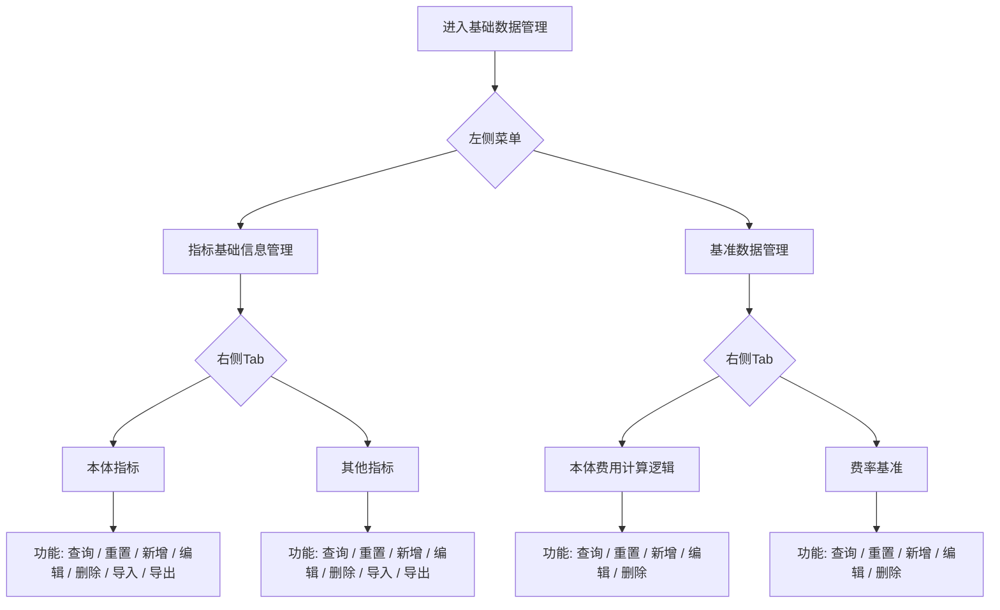
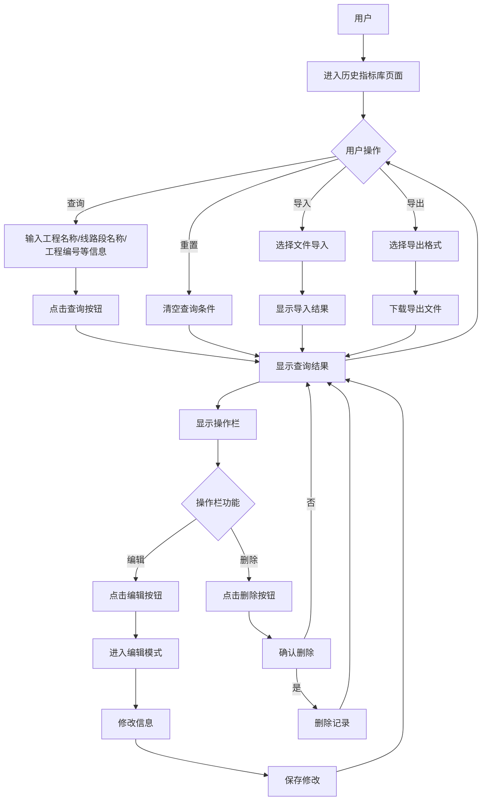
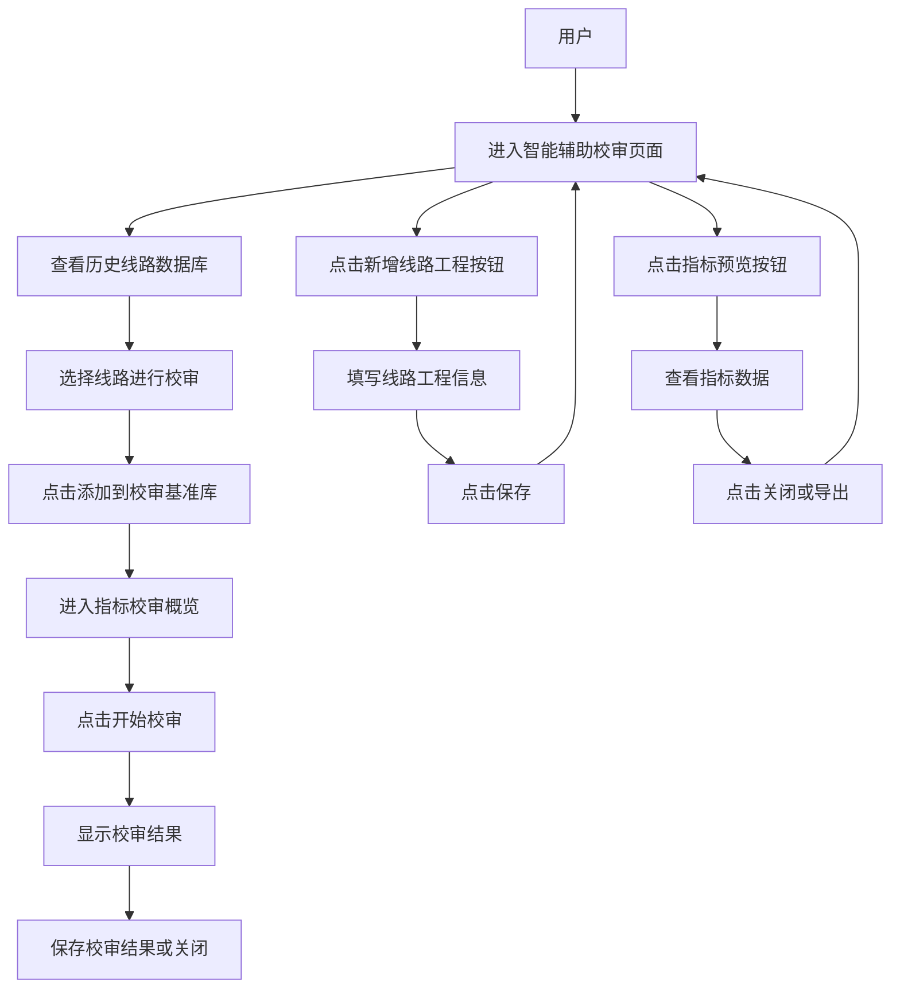

> 提示词：

- 这是一个项目的原型图，页面是历史指标库，请你根据页面内容写一个流程图，格式为mermaid，另外表格的右边有一个操作栏部分，功能是编辑和删除。

- 根据这个流程图用一段文字简单描述一下前端主要处理流程，描述成一段文字，简要概括即可，字数在250字以内

## 基础数据管理

> 在基础数据管理模块中，前端主要实现了左侧菜单与右侧 Tab 的切换逻辑，支持本体指标、其他指标、本体费用计算逻辑和费率基准四个页面的数据管理。整体流程涵盖查询、重置、表格渲染与刷新，以及新增、编辑、删除等表单弹窗操作；其中本体指标和其他指标额外支持导入、导出功能。前端负责表单校验、接口请求、文件上传下载和操作结果提示，保证数据管理的完整交互闭环。

## 历史指标库

> 

## 智能校审

用户进入智能辅助校审页面后，可以选择历史线路进行校审，或通过“添加线路工程”按钮新增线路。新增线路时，用户需填写相关信息并保存。在校审过程中，用户可以预览指标数据，进行校审，并保存结果。

